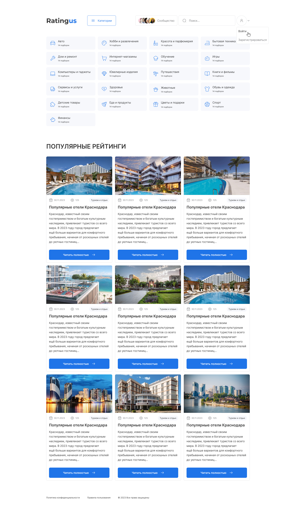

<h1 align="center">Greetings, Esteemed Colleagues! 👋, I'm Anton Zhilin</h1>
<h3 align="center">A passionate Frontend developer from Russia, Moskow</h3>

I am involved in frontend development for commercial projects within the React ecosystem, using TypeScript, Next.js, ReduxToolkit, Zustand. I read a lot of literature on the intersection of business and software development. I'm also a frequent visitor to LeetCode and Codewars, and enjoy reading about architecture, design patterns, and system design.

I'm an explorer of new tech, an avid learner, and a problem-solver at heart. When I'm not in code, you'll find me watching tech-related YouTube videos, fueling my curiosity.

Feel free to connect with me @antonzhilin83 for all things tech or just to say hello! Let's shape the future of tech together. 🌟

Joined Github **4** years ago.

Since then I pushed **2944**+ commits, opened **229**+ issues, submitted **375**+ pull requests, created **20**+ gists and contributed to **9**+ public repositories.

### Talking about Personal Stuff:

🚀 &nbsp; I’m currently working with TypeScript, Next.js, ReduxToolkit, Zustand, Scrum.
👾 &nbsp; Fun fact: Equal is Not Always Equal in JS.
📫 &nbsp; Reach me out: antonzhilin83@yandex.ru.

### My Absolute Favorites:

- 💻 &nbsp; I love exploring new technologies and building cool stuff.
- 📰 &nbsp; Reading, writing & watching Tech Stuff whenever possible.
- 🍕 &nbsp; Meetups & Tech Events & Hackathons.

<h3 align="left">Connect with me:</h3>

<h3 align="left">Languages and Tools:</h3>

   
   
  
  

### I’m currently working on this project:

## Online service for rating assessment and comparison of the best products and services based on expert opinion, user voting, reviews, and testimonials.

