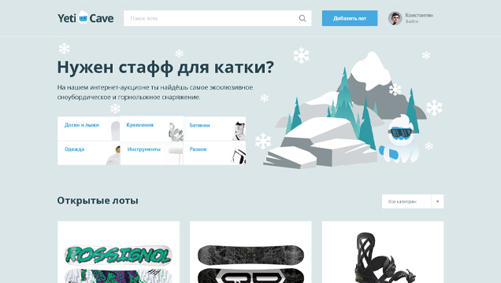

<h1 align="center">Hi 👋, I'm Anton Zhilin</h1>
<h3 align="center">A passionate Frontend developer from Russia, Moskow</h3>

I am a Frontend developer currently working on the OOO Service Market with a mission to revolutionize web development for small businesses. 🚀

I have a passion for problem-solving and pioneering first-principle thinking, driven by purpose and fueled by the challenge of finding solutions, with a strong foundation in HTML, CSS, Javascript, etc. I have developed more than 16 complex, cross-browser, and responsive websites and landing pages for small businesses together with a team. I increased the performance of the websites by 15% by optimizing fonts and raster graphics. One of them that I can show is an online service for selling water purification devices for homes and offices at http://waterdel.ru/. Non-disclosure agreements are in place for the rest..

I'm an explorer of new tech, an avid learner, and a problem-solver at heart. When I'm not in code, you'll find me watching tech-related YouTube videos, fueling my curiosity.

Feel free to connect with me @antonyMinistrov for all things tech or just to say hello! Let's shape the future of tech together. 🌟

Joined Github **4** years ago.

Since then I pushed **2944**+ commits, opened **229**+ issues, submitted **375**+ pull requests, created **20**+ gists and contributed to **9**+ public repositories.

### Talking about Personal Stuff:

- 🛠 &nbsp; I’m currently working with HTML5, CSS 3, BEM, Sass, Less, Scss, PUG, Pixel-Perfect, WAI-ARIA, SVG, JavaScript(ES6), Git, Swiper.js, Lighthouse etc.
- 🚀 &nbsp; I’m currently exploring PHP, MySQL DBMS, SQL, HTTP protocol, Composer, OOP, OOP Architecture, Yii 2, DI/IOC and design patterns, Laravel, REST API, Eloquent models and relationships, Laravel Sanctum, Algorithms and data structures, React, Redux, React-redux, Redux (RTK Query, Redux-Toolkit), TypeScript (Utility Types, Generics, Literal Types), Next.js, Scrum, Testing (Unit, integration, e2e), Docker.
- 👾 &nbsp; Fun fact: Equal is Not Always Equal in JS.
- 📫 &nbsp; Reach me out: antonzhilin83@yandex.ru.

### My Absolute Favorites:

- 💻 &nbsp; I love exploring new technologies and building cool stuff.
- 📰 &nbsp; Reading, writing & watching Tech Stuff whenever possible.
- 🍕 &nbsp; Meetups & Tech Events & Hackathons.

<h3 align="left">Connect with me:</h3>

<h3 align="left">Languages and Tools:</h3>

              

### I’m currently working on this project:

- This is a simple service that allows users to sell their personal belongings at the most advantageous price for them, based on an auction system
- Stack: HTML5, CSS 3, BEM, PHP, SQL, СУБД MySQL, HTTP protocol, Cookies, Composer, Git

